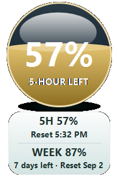

# Codex Usage Bubble

A Windows desktop overlay that shows the signed-in user's remaining five-hour and seven-day Codex usage.



The bubble is always on top, draggable, refreshed every minute, and launched silently at Windows sign-in. It starts on whichever window has less usage remaining; click the bubble to switch between 5-hour and weekly usage. Its water level follows the selected percentage, while its color blends continuously from green through amber to red. Both windows and their reset times remain visible in the lower panel.

Right-click the bubble to refresh, hide it to the Windows system tray, or exit. Left-click the tray icon to show or hide the bubble. The app stays out of the Windows taskbar.

## Install as a Codex plugin

Add this repository as a local Codex marketplace, then install `codex-usage-bubble`. In Codex, ask:

> Install my Codex usage bubble.

The included skill runs the deterministic installer from the plugin package.

## Manual install

From the plugin directory, run:

```powershell
powershell.exe -NoProfile -ExecutionPolicy Bypass -File .\scripts\install.ps1
```

This installs the GUI under `%LOCALAPPDATA%\CodexUsageBubble` and creates a current-user Windows login startup entry. Administrator access is not required.

## Requirements

- Windows 10 or 11
- A signed-in Codex installation discoverable through `CODEX_CLI_PATH`, `PATH`, or the VS Code OpenAI extension
- .NET Framework 4.x

## Build

```powershell
powershell.exe -NoProfile -ExecutionPolicy Bypass -File .\plugins\codex-usage-bubble\scripts\build.ps1
```

## Privacy

The utility starts the local `codex app-server` process and reads the account rate-limit response. It does not operate a separate server, require an API key, or send usage data to the repository publisher.

## License

MIT
